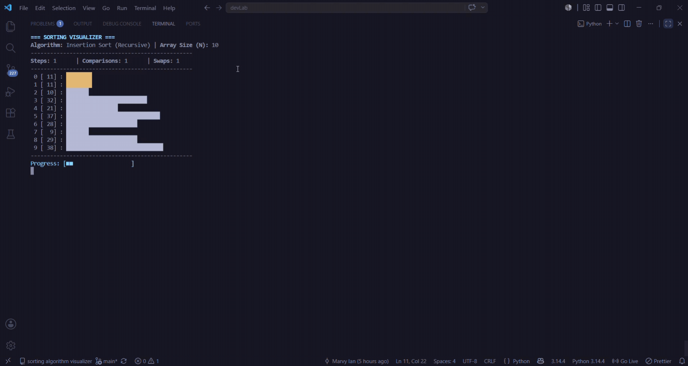

# Recursive Sorting Algorithm Visualizer

An interactive terminal-based Sorting Algorithm Visualizer built with Python that demonstrates how recursive sorting algorithms work through real-time ASCII animations.

<p align="center">
  
</p>

Unlike traditional sorting visualizers that rely heavily on iterative loops, this project showcases purely recursive implementations of multiple classical sorting algorithms. It is designed as an educational tool for learning recursion, understanding algorithm behavior, and comparing algorithm performance directly from the command line.

---

## Features

- Purely recursive implementations of five classical sorting algorithms
- Real-time terminal visualization using ASCII horizontal bar graphs
- Smooth animations powered by ANSI escape codes
- Live algorithm statistics during execution
  - Total steps
  - Comparisons
  - Swaps
- Color-coded visualization
  - 🟨 Yellow: Elements currently being compared or shifted
  - ⬜ White: Unsorted elements
  - 🟩 Green: Sorted elements
- Supports custom user-defined arrays
- Automatically generates randomized unique arrays
- Adjustable visualization speed
  - Slow
  - Normal
  - Fast
- Automatic benchmarking for all algorithms
- Comparative performance summary after execution

---

## Supported Algorithms

| Algorithm | Description |
|-----------|-------------|
| Bubble Sort | Recursively performs bubble passes until all elements are sorted. |
| Insertion Sort | Recursively sorts subarrays before inserting each element into its proper position. |
| Merge Sort | Recursively divides arrays and merges them back together using recursive merging. |
| Quick Sort | Uses recursive partitioning around a pivot to divide and sort the array. |
| Heap Sort | Builds a max heap recursively and repeatedly extracts the root element. |

---

## Visualization

The array is rendered as horizontal ASCII bars that update in real time while the algorithm executes.

### Color Legend

| Color | Meaning |
|-------|---------|
| 🟨 Yellow | Current comparison or shift |
| ⬜ White | Unsorted element |
| 🟩 Green | Sorted element |

During execution, the visualizer continuously displays:

- Current array state
- Active algorithm
- Total steps
- Comparisons
- Swaps
- Execution progress

---

## Performance Summary

After completing all selected algorithms, the application automatically generates a benchmark table comparing their performance.

Metrics include:

- Execution time
- Total comparisons
- Total swaps
- Total steps

The program also highlights the best-performing algorithm for each performance category.

---

## Technical Stack

The project is built entirely with Python's standard library.

| Module | Purpose |
|---------|---------|
| `os` | Terminal operations and screen management |
| `sys` | Output flushing and Windows ANSI terminal support |
| `time` | High-precision timing and animation delays |
| `random` | Randomized array generation |

---

## Requirements

- Python 3.10 or later
- Terminal with ANSI escape sequence support

No third-party libraries are required.

---

## Installation

Clone the repository:

```bash
git clone https://github.com/your-username/recursive-sorting-visualizer.git
```

Navigate to the project directory:

```bash
cd recursive-sorting-visualizer
```

Run the application:

```bash
python main.py
```

---

## Project Structure

```text
recursive-sorting-visualizer/
│
├── assets/
│   └── demo.gif
│
├── main.py
├── README.md
└── LICENSE
```

---

## Usage

1. Launch the application.
2. Select a sorting algorithm or choose to benchmark all algorithms.
3. Enter a custom array or generate a random dataset.
4. Choose a visualization speed.
5. Watch the recursive sorting process unfold in real time.
6. Review the final benchmark summary.

---

## Sample Output

Below is real output captured from a run of `main.py` (ANSI colors will render in an actual terminal; shown here as plain text).

### Startup Prompts

```text
Welcome to the Recursive Sorting Algorithm Visualizer!

Enter default array size N (e.g., 15): 8
Provide comma-separated numbers (or press Enter to randomize): 5,2,9,1,7,3,8,4
Choose visual runtime animation speed (slow / normal / fast): fast
```

### Live Frame (mid-sort)

```text
=== SORTING VISUALIZER ===
Algorithm: Bubble Sort (Recursive) | Array Size (N): 8
--------------------------------------------------
Steps: 5      | Comparisons: 5      | Swaps: 4     
--------------------------------------------------
 0 [  2] : ██████
 1 [  5] : ████████████████
 2 [  1] : ███
 3 [  7] : ███████████████████████
 4 [  3] : ██████████
 5 [  9] : ██████████████████████████████
 6 [  8] : ██████████████████████████
 7 [  4] : █████████████
--------------------------------------------------
Progress: [■■■■■■              ]
```

### Final Comparison Summary

```text
=========================== FINAL COMPARISON SUMMARY ===========================
Algorithm                 | Array Size | Steps    | Swaps    | Comparisons  | Time (ms) 
-------------------------------------------------------------------------------------
Bubble Sort (Baseline)    | 8          | 28       | 13       | 28           | 566.01    
Insertion Sort (Baseline) | 8          | 20       | 13       | 18           | 406.02    
Merge Sort (Recursive)    | 8          | 24       | 24       | 17           | 969.41    
Quick Sort (Recursive)    | 8          | 16       | 12       | 16           | 444.41    
Heap Sort (Recursive)     | 8          | 23       | 19       | 25           | 383.75    
=====================================================================================
(* Green entries highlight the efficiency winners for that column category.)
```

*(In the actual terminal, unsorted bars appear white, bars currently being compared or shifted appear yellow, and fully sorted bars turn green; the "Green entries" note above refers to the benchmark table, where green marks the best score per column.)*

---

## Educational Objectives

This project demonstrates:

- Recursive programming techniques
- Classical sorting algorithms
- Divide-and-conquer strategies
- Recursive state management
- Algorithm analysis
- Performance benchmarking
- Terminal-based visualization
- ANSI escape code rendering

---

## Project Highlights

- 100% recursive algorithm implementations
- Interactive command-line interface
- Real-time ASCII animations
- Live performance metrics
- Benchmark comparison across algorithms
- Lightweight implementation using only Python's standard library

---

## Future Improvements

Potential enhancements include:

- Additional recursive sorting algorithms
- Vertical bar graph visualization
- CSV export for benchmark results
- Custom terminal color themes
- Interactive pause and resume controls
- Sound effects during sorting
- Support for larger datasets
- Time complexity visualization

---

## License

This project is available for educational and personal use.

---

## Author

Developed as an educational Python project to demonstrate recursive sorting algorithms, terminal visualization, and algorithm performance analysis.